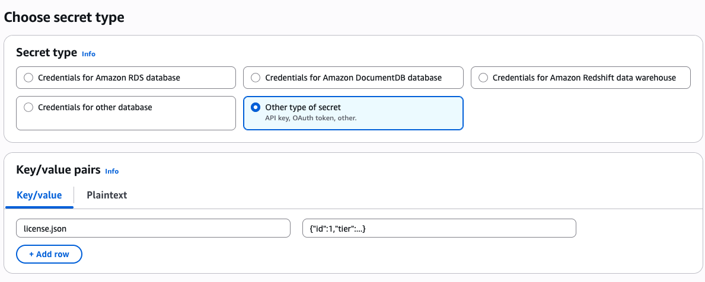
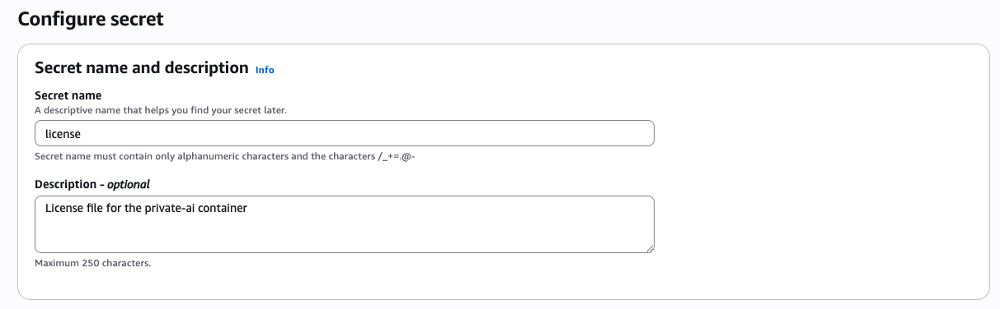
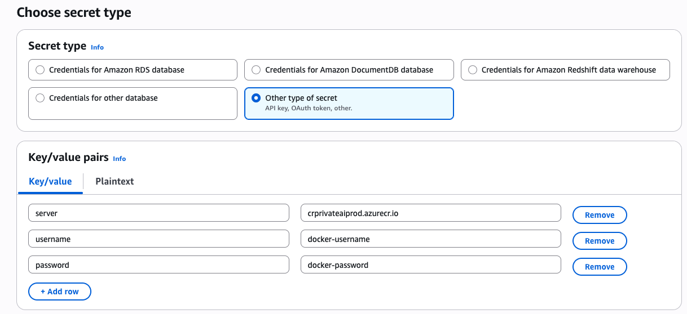
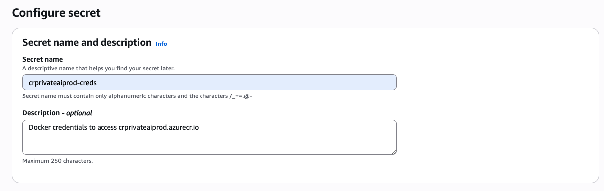
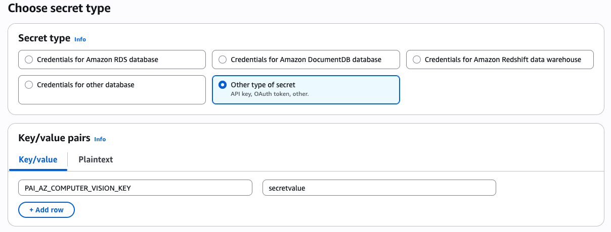

# Private AI Helm Chart

This infrastructure as code project is suitable for a development environment release of the Private AI product.
Feel free to use this Helm chart as a boilerplate for your Private AI container deployment.

Please keep in mind that for deployments requiring a public facing endpoint, you will need to provide your own cerificate / deployment configurations. This Helm chart is meant to help you get started with your deployment, and is NOT ready to be used directly for a production deployment.

## Prerequisites

- You must have a valid Private AI license file and docker credentials. If you do not have both, please [contact us](https://www.private-ai.com/en/company/contact-us)
- You must have an existing kubernetes cluster

## Installing the chart

To install the Private AI chart, follow the steps below

```console
# Create a namespace in your cluster for the private-ai deployment
kubectl create namespace private-ai

# Create a secret with your docker credentials from the customer portal
kubectl -n private-ai create secret docker-registry crprivateaiprod-creds \
    --docker-server=crprivateaiprod.azurecr.io \
    --docker-username=USERNAME \
    --docker-password=PASSWORD

# Login to the helm registry with your docker credentials
helm registry login crprivateaiprod.azurecr.io

# Create a custom values file for your specific installation
helm show values oci://crprivateaiprod.azurecr.io/helm/private-ai:1.4.0 > values.custom.yaml

# Copy your license.json file contents and paste them into the license.data section of the values.custom.yaml file with single quotes surrounding, as per below
license:
  data: '{"id":"..."}'

# Upgrade or install the Private AI chart with a name and namespace of private-ai
helm upgrade --install \
--namespace private-ai \
private-ai \
-f values.custom.yaml \
oci://crprivateaiprod.azurecr.io/helm/private-ai \
--version 1.4.0
```

## Testing

To test the Private AI container is functional, follow the steps below.

```console
helm test --namespace private-ai private-ai
```

## Uninstall

To uninstall the Private AI container, follow the steps below.

```console
helm uninstall --namespace private-ai private-ai
```

## Additional Configuration
To customize your deployment, enable different sections of your values.yaml file as per the documentation below.

### Ingress Controller
If you would like to set up an external ingress to enable external traffic to reach your the Private AI deployment, you must enable the ingress-nginx and cert-manager helm charts in the values.yaml file. Additionally, a sample ingress deployment file is included, and can be deployed with self-signed certificates for testing.

If you would like to deploy your own certificate issuer and certificates, please see the [cert-manager docs](https://cert-manager.io/docs/)

The ingress-nginx configuration required to host a certificate and manage incoming traffic from the ingress to the Private AI deployment is included with the chart. For more advanced configuration, please see the [ingress-nginx docs](https://github.com/kubernetes/ingress-nginx)

### External Secrets Operator
If you would like to store you license file and docker credentials in an external secret store, you can use the External Secrets Operator helm chart. Note: The External Secrets chart is not listed as a dependency in this chart, and must be installed separately prior to installation.

```console
# Create a namespace in your cluster for the private-ai deployment
kubectl create namespace private-ai

# Add the External Secrets helm repo
helm repo add external-secrets https://charts.external-secrets.io
helm repo update

# Upgrade or install the External Secrets operator into the private-ai namespace
helm -n private-ai upgrade --install external-secrets external-secrets/external-secrets

# Create two secrets, one for the license file and one for the docker credentials, in your external secret store of choice
```
#### Example AWS secret for Private AI license file


#### Example AWS secret for Private AI docker credentials


#### Example AWS secret for Private AI environment variables
This is optional, and can be enabled or disabled in the values file.



```console
# Create a secret-store within the private-ai namespace
# See https://external-secrets.io/latest/api/secretstore/ for detailed instructions
# Example AWS secret store based on access key:
kubectl create secret -n private-ai generic awssm-secret --from-file=./access-key --from-file=./secret-access-key
kubectl apply -f aws-secret-store.yaml
```
```yaml
# aws-secret-store.yaml
apiVersion: external-secrets.io/v1
kind: SecretStore
metadata:
  name: secret-store
  namespace: private-ai
spec:
  provider:
    aws:
      service: SecretsManager
      region: ca-central-1
      auth:
        secretRef:
          accessKeyIDSecretRef:
            namespace: private-ai
            name: awssm-secret
            key: access-key
          secretAccessKeySecretRef:
            namespace: private-ai
            name: awssm-secret
            key: secret-access-key
```
```console
# Update your values.custom.yaml file to enable the external secrets operator, and disable the default secret creation
# Ensure to update the docker credentials and license remoteRefKey and properties as per the secret names and properties, respectively
externalsecrets:
  enabled: true
...

# Proceed with installing / upgrading private-ai via helm into the private-ai namespace
helm upgrade --install \
--namespace private-ai \
private-ai \
-f values.custom.yaml \
oci://crprivateaiprod.azurecr.io/helm/private-ai \
--version 1.4.0
```
